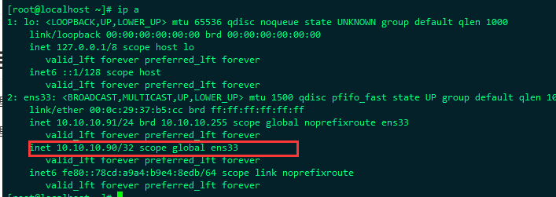
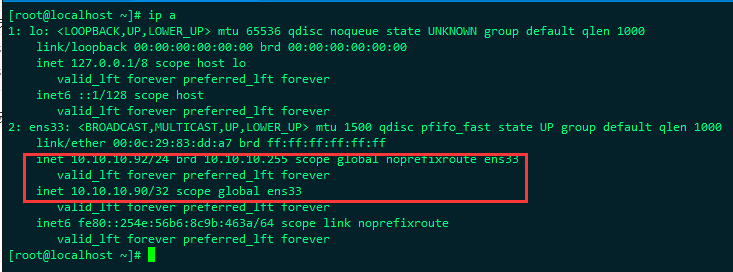

## keepalived

## 简介

keepalived工作模式：抢占式和非抢占式

## 实验环境

| IP          | 用途             |
| ----------- | ---------------- |
| 10.10.10.91 | keepalived+nginx |
| 10.10.10.92 | keepalived+nginx |
| 10.10.10.90 | VIP（虚拟IP）    |

实验图：


## 实验准备

关闭防火墙和selinux

```
systemctl stop firewalld
systemctl disbale firealld
setenforce 0
sed -i 's/SELINUX=enforcing/SELINUX=disabled/g' /etc/selinux/config
```


## 安装相关软件

这里为了方便全部使用yum安装

两台机器都要安装

```
yum install keepalived nginx -y
```

如果直接yum安装nginx无法安装的需要安装epel-release扩展包

```
yum install epel-release -y
```


## 配置keepalived

### 抢占式模式配置

#### Master

这里我使用10.10.10.91作为master节点

> ```
> cat /etc/keepalived/keepalived.conf
> ```

```
! Configuration File for keepalived

global_defs {
    router_id 10.10.10.91 #标识信息，我比较喜欢使用ip做标识；
}

vrrp_script chk_nginx {
    script "/etc/keepalived/check_nginx.sh"
    interval 2
    weight -20
}

vrrp_instance VI_1 {
    state MASTER    #角色是master
    interface ens33  #vip 绑定的网卡名称
    virtual_router_id 10
    priority 100            #优先级，master优先级高于backup;
    advert_int 1            #心跳间隔时间
    authentication {
        auth_type PASS      #认证
        auth_pass 1111      #密码
    }
    
    track_script {
        chk_nginx
    }
    
    virtual_ipaddress {
        10.10.10.90   #VIP,可以有多个
    }
}
```


#### Backup

10.10.10.92

> ```
> cat /etc/keepalived/keepalived.conf
> ```

```
! Configuration File for keepalived

global_defs {
    router_id 10.10.10.92 #标识信息，我比较喜欢使用ip做标识；
}

vrrp_script chk_nginx {
    script "/etc/keepalived/check_nginx.sh"
    interval 2
    weight -20
}

vrrp_instance VI_1 {
    state BACKUP    #角色是BACKUP
    interface ens33  #vip 绑定的网卡名称
    virtual_router_id 10
    priority 90            #优先级，master优先级高于backup;
    advert_int 1            #心跳间隔时间
    authentication {
        auth_type PASS      #认证
        auth_pass 1111      #密码
    }
    
    track_script {
        chk_nginx
    }
    
    virtual_ipaddress {
        10.10.10.90   #VIP,可以有多个
    }
}
```


#### check_nginx.sh

cat /etc/keepalived/check_nginx.sh

```shell
#!/bin/sh
nginxpid=$(ps -C nginx --no-header|wc -l)
if [ $nginxpid -eq 0 ];then
    systemctl start nginx
    sleep 3
    nginxpid=$(ps -C nginx --no-header|wc -l)
    if [ $nginxpid -eq 0 ];then
       exit 1
    fi
fi
```

注意：脚本增加可执行权限


### 非抢占模式配置

非抢占模式没有

#### Master

> ```
> cat /etc/keepalived/keepalived.conf
> ```

```
! Configuration File for keepalived

global_defs {
    router_id 10.10.10.91 #标识信息，我比较喜欢使用ip做标识；
}

vrrp_script chk_nginx {
    script "/etc/keepalived/check_nginx.sh"
    interval 2
    weight -20
}

vrrp_instance VI_1 {
    state BACKUP    #
    interface ens33  #vip 绑定的网卡名称
    virtual_router_id 10
    priority 100            #优先级，master优先级高于backup;
    nopreempt
    advert_int 1            #心跳间隔时间
    authentication {
        auth_type PASS      #认证
        auth_pass 1111      #密码
    }
    
    track_script {
        chk_nginx
    }

    virtual_ipaddress {
        10.10.10.90   #VIP,可以有多个
    }
}
```


#### Backup

10.10.10.92

> ```
> cat /etc/keepalived/keepalived.conf
> ```

```
! Configuration File for keepalived

global_defs {
    router_id 10.10.10.92 #标识信息，我比较喜欢使用ip做标识；
}

vrrp_script chk_nginx {
    script "/etc/keepalived/check_nginx.sh"
    interval 2
    weight -20
}

vrrp_instance VI_1 {
    state BACKUP    #角色是BACKUP
    interface ens33  #vip 绑定的网卡名称
    virtual_router_id 10
    priority 90            #优先级，master优先级高于backup;
    nopreempt
    advert_int 1            #心跳间隔时间
    authentication {
        auth_type PASS      #认证
        auth_pass 1111      #密码
    }
    
    track_script {
        chk_nginx
    }
    
    virtual_ipaddress {
        10.10.10.90   #VIP,可以有多个
    }
}
```


#### check_nginx.sh

> ```
> cat /etc/keepalived/check_nginx.sh
> ```

```shell
#!/bin/sh
nginxpid=$(ps -C nginx --no-header|wc -l)
if [ $nginxpid -eq 0 ];then
    systemctl start nginx
    sleep 3
    nginxpid=$(ps -C nginx --no-header|wc -l)
    if [ $nginxpid -eq 0 ];then
       exit 1
    fi
fi
```

注意：脚本增加可执行权限


## 启动测试

这里我只做了抢占模式的演示，抢占模式下，主服务器正常的情况下VIP一定是绑定在主服务器下的，非抢占模式VIP漂移后是不会自动漂移的，除非机器故障

这里先将nginx的默认页面做一个修改，为了方便辨别，两台机器分别增加一行IP显示


```
两台机器都要启动
systemctl start nginx
systemctl start keepalived
```

启动后可以在10.10.10.91服务器上看到VIP已经启动了



这时访问VIP，可以看到现在显示的也是10.10.10.91服务器的ip


停掉91服务器上的keepalived，可以看到VIP很快就漂移到了10.10.10.92服务器上,注意这里可能存在keepalived进程无法全部停止的情况，可以尝试将文件“/usr/lib/systemd/system/keepalived.service”中的“KillMode=process”注释，然后使用"systemctl daemon-reload"重新加载启动文件后再尝试重启keepalived服务



此时再通过浏览器访问VIP地址，可以看到显示的已经变化了，这时我们再将91服务器山的keepalived启动，会发现VIP又会重新回到91服务器上


如果想使用停止nginx的方式测试，请将脚本的中systemctl start nginx注释，防止脚本自动拉起nginx服务


## 注意：

!!! danger "**注意**"
    生产环境上一般配置的都是非抢占模式，一定要注意了VIP是不是能随便漂移的这是生产事故。

