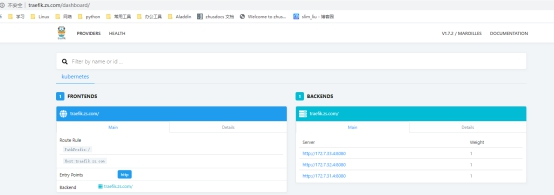
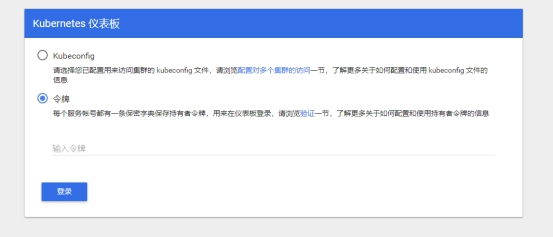

## 5、安装核心插件

### 5.1、K8S的CNI网络插件-Flannel

#### 5.1.1、下载软件包

软件下载地址：

https://github.com/coreos/flannel/releases

版本：v0.11.0

\# cd /opt/src

wget https://github.com/coreos/flannel/releases/download/v0.11.0/flannel-v0.11.0-linux-amd64.tar.gz


#### 5.1.2、创建相关目录解压软件包

```
mkdir /opt/flannel-v0.11.0
tar xf flannel-v0.11.0-linux-amd64.tar.gz -C /opt/flannel-v0.11.0
ln -s /opt/flannel-v0.11.0 /opt/flannel
```

 

#### 5.1.3、拷贝证书

!!! warning "flannel需要连接etcd这里需要client证书及相关私钥"

```
cd /opt/flannel
mkdir certs && cd certs
scp  root@10.4.7.200:/opt/certs/ca.pem .
scp  root@10.4.7.200:/opt/certs/client.pem .
scp  root@10.4.7.200:/opt/certs/client-key.pem .
```


#### 5.1.4、创建配置文件

注意修改FLANNEL_SUBNET

```
cd /opt/flannel
```

> vim subnet.env

```
# 注意FLANNEL_SUBNET每台机器不同，这个地址是docker的网段
FLANNEL_NETWORK=172.7.0.0/16
FLANNEL_SUBNET=172.7.31.1/24
FLANNEL_MTU=1500
FLANNEL_IPMASQ=false
```


#### 5.1.5、创建启动脚本

> vim flanneld.sh

!!! waring "注意public-ip和iface网卡名称"

```
#!/bin/bash
./flanneld \
--public-ip=10.4.7.31 \
--etcd-endpoints=https://10.4.7.32:2379,https://10.4.7.32:2379,https://10.4.7.32:2379 \
--etcd-keyfile=./certs/client-key.pem \
--etcd-certfile=./certs/client.pem \
--etcd-cafile=./certs/ca.pem \
--iface=ens33 \
--subnet-file=./subnet.env \
--healthz-port=2401
```


#### 5.1.6、检查配置、权限、创建日志目录

```
chmod +x /opt/flannel/flanneld.sh
mkdir -p /data/logs/flanneld
```


#### 5.1.7、设置flannel的网络配置

 此步骤在任意etcd节点上执行，执行一次即可

> host-gw模型

```
etcdctl set /coreos.com/network/config '{"Network": "172.7.0.0/16","Backend": {"Type": "host-gw"}}'
```

验证

\# etcdctl get /coreos.com/network/config
{"Network": "172.7.0.0/16","Backend": {"Type": "host-gw"}}


附其他网络模型

> VxLan模型

'{"Network": "172.7.0.0/16","Backend": {"Type": "VxLan"}}'

> 直接路由模型

'{"Network": "172.7.0.0/16","Backend": {"Type": "VxLan","Directrouting"： true}}'


#### 5.1.8、创建flannel的supervisor配置文件

> vim /etc/supervisord.d/flanneld.ini 

```
[program:flanneld]
command=/opt/flannel/flanneld.sh
numprocs=1
directory=/opt/flannel
autostart=true
autorestart=true
startsecs=30
startretries=3
exitcodes=0,2
stopsignal=QUIT
stopwaitsecs=10
user=root
redirect_stderr=true
stdout_logfile=/data/logs/flanneld/flanneld.stdout.log
stdout_logfile_maxbytes=64MB
stdout_logfile_backups=4
stdout_capture_maxbytes=1MB
stdout_events_enabled=false
```


#### 5.1.9、启动验证

```
supervisorctl update 
```

验证

ping 另一个宿主机上的pod

这里如果有ping不通的可以尝试

iptables -P INPUT ACCEPT

iptables -P FORWARD ACCEPT


#### 5.1.10、优化

##### 5.1.10.1、安装iptables

```
yum install -y iptables-services
systemctl start iptables
systemctl enable iptables
```


##### 5.1.10.2、优化iptables规则

主要优化postrouting -s 172.7.31.0？24  ! -o docker0 -j MASQUERADE这条规则

\# iptables-save |grep -i postrouting

删除此条规则

\# iptables -t nat -D +规则名称


插入一条规则

\# iptables -t nat -I POSTROUTING -s 172.7.31.0/24 ! -d 172.7.0.0/16 ! -o docker0 -j MASQUERADE

 

保存

\# iptables-save > /etc/sysconfig/iptables

注意要删除两台机器上的reject规则，否则会出现容器之间无法通信的问题

验证方式，通过容器去访问另一台机器山的容器，查看来源ip是否进行了转换

 


### 5.2、K8S的DNS服务插件-CoreDNS

#### 5.2.1、准备镜像

此步骤在运维主机上操作

> 获取镜像

```
docker pull docker.io/coredns/coredns:1.6.1
```

> 打tag

```
docker tag c0f6e815079e harbor.zs.com/public/coredns:v1.6.1
```

> 推送到私有仓库

```
docker push harbor.zs.com/public/coredns:v1.6.1
```


#### 5.2*.2、准备资源配置清单

此步骤在运维主机上操作

官方参考地址：

https://github.com/kubernetes/kubernetes/tree/master/cluster/addons/dns/coredns


##### 5.2.2.1、Rabc

> vim /data/k8s-yaml/coredns/rbac.yaml

```yaml
apiVersion: v1
kind: ServiceAccount
metadata:
  name: coredns
  namespace: kube-system
  labels:
    kubernetes.io/cluster-service: "ture"
    addonmanager.kubernetes.io/mode: Reconcile
---
apiVersion: rbac.authorization.k8s.io/v1
kind: ClusterRole
metadata:
  labels:
    kubernetes.io/bootstrapping: rbac-defaults
    addonmanager.kubernetes.io/mode: Reconcile
  name: system:coredns
rules:
- apiGroups:
  - ""
  resources:
  - endpoints
  - services
  - pods
  - namespaces
  verbs:
  - list
  - watch
---
apiVersion: rbac.authorization.k8s.io/v1
kind: ClusterRoleBinding
metadata:
  annotations:
    rbac.authorization.kubernetes.io/autoupdate: "true"
  labels:
    kubernetes.io/bootstrapping: rbac-defaults
    addonmanager.kubernetes.io/mode: EnsureExists
  name: system:coredns
roleRef:
  apiGroup: rbac.authorization.k8s.io
  kind: ClusterRole
  name: system:coredns
subjects:
- kind: ServiceAccount
  name: coredns
  namespace: kube-system
```


##### 5.2.2.2、configMap

注意文件中的forward地址是我们的内网dns地址

\# cat /data/k8s-yaml/coredns/cm.yaml

```yaml
apiVersion: v1
kind: ConfigMap
metadata:
  name: coredns
  namespace: kube-system
data:
  Corefile: |
    .:53 {
        errors
        health
        ready
        kubernetes cluster.local 192.168.0.0/16
        forward . 10.4.7.10
        cache 30
        loop
        reload
        loadbalance
      }
```


##### 5.2.2.3、Deployment

> vim /data/k8s-yaml/coredns/dp.yaml

```yaml
apiVersion: apps/v1
kind: Deployment
metadata:
  name: coredns
  namespace: kube-system
  labels:
    k8s-app: coredns
    kubernetes.io/cluster-service: "true"
    kubernetes.io/name: "CoreDNS"
spec:
  replicas: 3
  selector:
    matchLabels:
      k8s-app: coredns
  template:
    metadata:
      labels:
        k8s-app: coredns
    spec:
      priorityClassName: system-cluster-critical
      serviceAccountName: coredns
      containers:
      - name: coredns
        image: harbor.zs.com/public/coredns:v1.6.1
        args:
        - "-conf"
        - "/etc/coredns/Corefile"
        volumeMounts:
        - name: config-volume
          mountPath: /etc/coredns
        ports:
        - containerPort: 53
          name: dns
          protocol: UDP
        - containerPort: 53
          name: dns-tcp
          protocol: TCP
        - containerPort: 9153
          name: mecrics
          protocol: TCP
        livenessProbe:
          httpGet:
            path: /health
            port: 8080
            scheme: HTTP
          initialDelaySeconds: 60
          timeoutSeconds: 5
          successThreshold: 1
          failureThreshold: 5
      dnsPolicy: Default
      volumes:
        - name: config-volume
          configMap:
            name: coredns
            items:
            - key: Corefile
              path: Corefile
```


##### 5.2.2.4、Service

注意clusterIP要是你自己规划的集群IP池中的地址

> vim  /data/k8s-yaml/coredns/svc.yaml

```yaml
apiVersion: v1
kind: Service
metadata:
  name: coredns
  namespace: kube-system
  labels:
    k8s-app: coredns
    kubernetes.io/cluster-service: "true"
    kunernetes.io/name: "CoreDNS"
spec:
  selector:
    k8s-app: coredns
  clusterIP: 192.168.0.2
  ports:
  - name: dns
    port: 53
    protocol: UDP
  - name: dns-tcp
    port: 53
    protocol: TCP
  - name: metrics
    port: 9153
    protocol: TCP
```


#### 5.2.3、创建相关资源

!!! tip "此步骤在任意计算节点执行"

```shell
kubectl apply -f http://k8s-yaml.zs.com/coredns/rbac.yaml
kubectl apply -f http://k8s-yaml.zs.com/coredns/cm.yaml
kubectl apply -f http://k8s-yaml.zs.com/coredns/dp.yaml
kubectl apply -f http://k8s-yaml.zs.com/coredns/svc.yaml
```


#### 5.2.4、检查验证

```
kubectl get all -n kube-system
kubectl expose deployment nginx-dp --port=80 -n kube-public
kubectl get svc -n kube-public
dig -t A nginx-dp.kube-public.svc.cluster.local. @192.168.0.2 +short
```


### 5.3、K8S的服务暴露插件-Traefik

#### 5.3.1、准备镜像

此步骤在运维主机上操作

下载镜像

\# docker pull traefik:v1.7.2-alpine

打包镜像

\# docker tag add5fac61ae5 harbor.zs.com/public/traefik:v1.7.2

推送镜像到私有仓库

\# docker push harbor.zs.com/public/traefik:v1.7.2

#### 5.3*.3、准备资源配置清单

此步骤在运维主机上操作

官方参考地址：

https://github.com/containous/traefik/blob/v1.7.2/examples/k8s

```shell
mkdir /data/k8s-yaml/traefik
```


##### 5.3.2.1、RBAC

> vim  /data/k8s-yaml/traefik/rbac.yaml

```yaml
---
apiVersion: v1
kind: ServiceAccount
metadata:
  name: traefik-ingress-controller
  namespace: kube-system
---
kind: ClusterRole
apiVersion: rbac.authorization.k8s.io/v1beta1
metadata:
  name: traefik-ingress-controller
rules:
  - apiGroups:
      - ""
    resources:
      - services
      - endpoints
      - secrets
    verbs:
      - get
      - list
      - watch
  - apiGroups:
      - extensions
    resources:
      - ingresses
    verbs:
      - get
      - list
      - watch
---
kind: ClusterRoleBinding
apiVersion: rbac.authorization.k8s.io/v1beta1
metadata:
  name: traefik-ingress-controller
roleRef:
  apiGroup: rbac.authorization.k8s.io
  kind: ClusterRole
  name: traefik-ingress-controller
subjects:
- kind: ServiceAccount
  name: traefik-ingress-controller
  namespace: kube-system
```


##### 5.3.2.2、DemonSet

!!! warning "注意k8s集群调用地址，修改为自己的负载均衡地址"

> vim /data/k8s-yaml/traefik/ds.yaml

```yaml
---
kind: DaemonSet
apiVersion: extensions/v1beta1
metadata:
  name: traefik-ingress
  namespace: kube-system
  labels:
    k8s-app: traefik-ingress
spec:
  template:
    metadata:
      labels:
        k8s-app: traefik-ingress
        name: traefik-ingress
    spec:
      serviceAccountName: traefik-ingress-controller
      terminationGracePeriodSeconds: 60
      containers:
      - image: harbor.zs.com/public/traefik:v1.7.2
        name: traefik-ingress
        ports:
        - name: http
          containerPort: 80
          hostPort: 81
        - name: admin-web
          containerPort: 8080
        securityContext:
          capabilities:
            drop:
            - ALL
            add:
            - NET_BIND_SERVICE
        args:
        - --api
        - --kubernetes
        - --logLevel=INFO
        - --insecureskipverify=true
        - --kubernetes.endpoint=https://10.4.7.20:7443
        - --accesslog
        - --accesslog.filepath=/var/log/traefik_access.log
        - --traefiklog
        - --traefiklog.filepath=/var/log/traefik.log
        - --metrics.prometheus
```


##### 5.3.2.3、Service

\# cat /data/k8s-yaml/traefik/svc.yaml

```yaml
---
kind: Service
apiVersion: v1
metadata:
  name: traefik-ingress-service
  namespace: kube-system
spec:
  selector:
    k8s-app: traefik-ingress
  ports:
    - protocol: TCP
      port: 80
      name: ingress-controller
    - protocol: TCP
      port: 8080
      name: admin-web
```


##### 5.3.2.4、Ingress

\# cat /data/k8s-yaml/traefik/ingress.yaml

```yaml
---
apiVersion: extensions/v1beta1
kind: Ingress
metadata:
  name: traefik-web-ui
  namespace: kube-system
  annotations:
    kubernetes.io/ingress.class: traefik
spec:
  rules:
  - host: traefik.zs.com
    http:
      paths:
      - path: /
        backend:
          serviceName: traefik-ingress-service
          servicePort: 8080
```


#### 5.3.3、创建相关资源

!!! tip "在任意计算节点执行"

```shell
kubectl apply -f http://k8s-yaml.zs.com/traefik/rbac.yaml
kubectl apply -f http://k8s-yaml.zs.com/traefik/ds.yaml
kubectl apply -f http://k8s-yaml.zs.com/traefik/svc.yaml
kubectl apply -f http://k8s-yaml.zs.com/traefik/ingress.yaml
```


#### 5.3.4、配置7层反向代理

在两台lvs主机上操作

> vim /etc/nginx/conf.d/zs.com.conf

```shell
upstream default_backend_traefik {
  server 10.4.7.31:81  max_fails=3 fail_timeout=10s;
  server 10.4.7.32:81  max_fails=3 fail_timeout=10s;
  server 10.4.7.33:81  max_fails=3 fail_timeout=10s;
}


server {

  server_name *.zs.com;

  location / {
    proxy_pass http://default_backend_traefik;
    proxy_set_header Host   $http_host;
    proxy_set_header x-forwarded-for $proxy_add_x_forwarded_for;
  }
}
```

> 检查配置

```
nginx -t
```

> 重启nginx

```
nginx -s reload
```


#### 5.3.5、配置域名解析

增加一条A记录，域名为traefik.zs.com，记录值为10.4.7.20


#### 5.3.6、访问验证

使用宿主机访问traefik.zs.com验证服务搭建是否正常

 

 

 

### 5.4、K8S的GUI资源管理插件-Dashboard

#### 5.4.1、准备镜像

此步骤在运维主机操作

官方地址：https://github.com/kubernetes/dashboard

> 获取镜像

```
docker pull k8scn/kubernetes-dashboard-and64:v1.10.1
docker pull hexun/kubernetes-dashboard-and64:v1.10.1
```

> 打tag

```
docker tag fcac9aa03fd6 harbor.zs.com/public/dashboard:v1.10.1
```

> 推送到私有仓库

```
docker push harbor.zs.com/public/dashboard:v1.10.1
```


#### 5.4.2、准备资源配置清单

此步骤在运维主机操作

##### 5.4.2.1、RBAC

> vim /data/k8s-yaml/dashboard/rbac.yaml

```yaml
apiVersion: v1
kind: ServiceAccount
metadata:
  labels:
    k8s-app: kubernetes-dashboard
    addonmanager.kubernetes.io/mode: Reconcile
  name: kubernetes-dashboard-admin
  namespace: kube-system
---
apiVersion: rbac.authorization.k8s.io/v1
kind: ClusterRoleBinding
metadata:
  name: kubernetes-dashboard-admin
  namespace: kube-system
  labels:
    k8s-app: kubernetes-dashboard
    addonmanager.kubernetes.io/mode: Reconcile
roleRef:
  apiGroup: rbac.authorization.k8s.io
  kind: ClusterRole
  name: cluster-admin
subjects:
- kind: ServiceAccount
  name: kubernetes-dashboard-admin
  namespace: kube-system
```


#### 5.4.2.2、Deployment

> vim  /data/k8s-yaml/dashboard/dp.yaml

```yaml
apiVersion: apps/v1
kind: Deployment
metadata:
  name: kubernetes-dashboard
  namespace: kube-system
  labels:
    k8s-app: kubernetes-dashboard
    kubernetes.io/cluster-service: "true"
    addonmanager.kubernetes.io/mode: Reconcile
spec:
  selector:
    matchLabels:
      k8s-app: kubernetes-dashboard
  template:
    metadata:
      labels:
        k8s-app: kubernetes-dashboard
      annotations:
        scheduler.alpha.kubernetes.io/critical-pod: ''
    spec:
      priorityClassName: system-cluster-critical
      containers:
      - name: kubernetes-dashboard
        image: harbor.zs.com/public/dashboard:v1.10.1
        resources:
          limits:
            cpu: 100m
            memory: 300Mi
          requests:
            cpu: 50m
            memory: 100Mi
        ports:
        - containerPort: 8443
          protocol: TCP
        args:
          # PLATFORM-SPECIFIC ARGS HERE
          - --auto-generate-certificates
        volumeMounts:
        - name: tmp-volume
          mountPath: /tmp
        livenessProbe:
          httpGet:
            scheme: HTTPS
            path: /
            port: 8443
          initialDelaySeconds: 30
          timeoutSeconds: 30
      volumes:
      - name: tmp-volume
        emptyDir: {}
      serviceAccountName: kubernetes-dashboard-admin
      tolerations:
      - key: "CriticalAddonsOnly"
        operator: "Exists"
```


#### 5.4.2.3、Service

> vim /data/k8s-yaml/dashboard/svc.yaml

```yaml
apiVersion: v1
kind: Service
metadata:
  name: kubernetes-dashboard
  namespace: kube-system
  labels:
    k8s-app: kubernetes-dashboard
    kubernetes.io/cluster-service: "true"
    addonmanager.kubernetes.io/mode: Reconcile
spec:
  selector:
    k8s-app: kubernetes-dashboard
  ports:
  - port: 443
    targetPort: 8443
```


#### 5.4.2.4、Ingress

> vim  /data/k8s-yaml/dashboard/ingress.yaml

```yaml
apiVersion: extensions/v1beta1
kind: Ingress
metadata:
  name: kubernetes-dashboard
  namespace: kube-system
  annotations:
    kubernetes.io/ingress.class: traefik
spec:
  rules:
  - host: dashboard.zs.com
    http:
      paths:
      - backend:
          serviceName: kubernetes-dashboard
          servicePort: 443
```


#### 5.4.3、创建相关资源

此步骤在任意计算节点执行

```shell
kubectl apply -f http://k8s-yaml.zs.com/dashboard/rbac.yaml
kubectl apply -f http://k8s-yaml.zs.com/dashboard/dp.yaml
kubectl apply -f http://k8s-yaml.zs.com/dashboard/svc.yaml
kubectl apply -f http://k8s-yaml.zs.com/dashboard/ingress.yaml
```


#### 5.4.4、增加DNS解析

增加一条A记录dashboard，解析地址10.4.7.20(集群vip)


#### 5.4.5、访问验证

通过宿主机的浏览器访问http://dashboard.zs.com

 


#### 5.4.6、配置dashboard的HTTPS访问

由于使用http我们无法使用令牌访问，因此我们要对dashboard配置https访问

##### 5.4.6.1、证书签发

!!! tip "此步骤在运维主机上操作"

> 切换目录

```
cd /opt/certs
```

> 创建私钥

```
(umask 077; openssl genrsa -out dashboard.zs.com.key 2048)
```

> 创建证书请求csr文件

```
openssl req -new -key dashboard.zs.com.key -out dashboard.zs.com.csr -subj "/CN=dashboard.zs.com/C=CN/ST=BJ/L=jinan/O=zs/OU=ops"
```

> 签发证书

```
openssl x509 -req -in dashboard.zs.com.csr -CA ca.pem -CAkey ca-key.pem -CAcreateserial -out dashboard.zs.com.crt -days 3650
```


##### 5.4.6.2、配置反向代理

此步骤在LVS主机上操作，两台机器的nginx都需要配置

>  拷贝证书

```
cd /etc/nginx
mkdir certs
cd certs
scp root@10.4.7.200:/opt/certs/dashboard.zs.com.crt .
scp root@10.4.7.200:/opt/certs/dashboard.zs.com.key .
```

 

> 增加配置文件
>
> vim /etc/nginx/conf.d/dashboard.zs.com.conf 

 

```
server {

  listen 80;
  server_name dashboard.zs.com;

  rewrite ^/(.*) https://$server_name/$1 permanent;
}

server {

  listen 443 ssl;
  server_name dashboard.zs.com;
  ssl_certificate    certs/dashboard.zs.com.crt;
  ssl_certificate_key  certs/dashboard.zs.com.key;
  ssl_session_cache   shared:SSL:1m;
  ssl_session_timeout  5m;
  ssl_protocols SSLv2 SSLv3 TLSv1;
  ssl_ciphers ALL:!ADH:!EXPORT56:RC4+RSA:+HIGH:+MEDIUM:+LOW:+SSLv2:+EXP;
  ssl_prefer_server_ciphers  on;

 
  location / {
    proxy_pass http://default_backend_traefik;
    proxy_set_header Host   $http_host;
    proxy_set_header x-forwarded-for $proxy_add_x_forwarded_for;
  }
}
```


##### 5.4.6.3、检查配置并重启nginx

```
nginx -t
nginx -s reload
```


#### 5.4.7、访问验证

通过宿主机访问dashbord.zs.com，可以查看到dashboard的页面


#### 5.4.8、获取Dashboard令牌登陆

获取令牌（token）

```
kubectl describe secrets -n kube-system $(kubectl -n kube-system get secret | awk '/kubernetes-dashboard-admin/{print $1}')
```

 

#### 5.4.9、创建普通用户认证脚本

在运维主机上操作，此步骤主要是为了做多用户管理，如无需求可以不操作

> cat /data/k8s-yaml/dashboard/rbac-minimal.yaml

```yaml
apiVersion: v1
kind: ServiceAccount
metadata:
  labels:
    k8s-app: kubernetes-dashboard
    addonmanager.kubernetes.io/mode: Reconcile
  name: kubernetes-dashboard
  namespace: kube-system
---
kind: Role
apiVersion: rbac.authorization.k8s.io/v1
metadata:
  labels:
    k8s-app: kubernetes-dashboard
    addonmanager.kubernetes.io/mode: Reconcile
  name: kubernetes-dashboard-minimal
  namespace: kube-system
rules:
  # Allow Dashboard to get, update and delete Dashboard exclusive secrets.
- apiGroups: [""]
  resources: ["secrets"]
  resourceNames: ["kubernetes-dashboard-key-holder", "kubernetes-dashboard-certs"]
  verbs: ["get", "update", "delete"]
  # Allow Dashboard to get and update 'kubernetes-dashboard-settings' config map.
- apiGroups: [""]
  resources: ["configmaps"]
  resourceNames: ["kubernetes-dashboard-settings"]
  verbs: ["get", "update"]
  # Allow Dashboard to get metrics from heapster.
- apiGroups: [""]
  resources: ["services"]
  resourceNames: ["heapster"]
  verbs: ["proxy"]
- apiGroups: [""]
  resources: ["services/proxy"]
  resourceNames: ["heapster", "http:heapster:", "https:heapster:"]
  verbs: ["get"]
---
apiVersion: rbac.authorization.k8s.io/v1
kind: RoleBinding
metadata:
  name: kubernetes-dashboard-minimal
  namespace: kube-system
  labels:
    k8s-app: kubernetes-dashboard
    addonmanager.kubernetes.io/mode: Reconcile
roleRef:
  apiGroup: rbac.authorization.k8s.io
  kind: Role
  name: kubernetes-dashboard-minimal
subjects:
- kind: ServiceAccount
  name: kubernetes-dashboard
  namespace: kube-system
```


修改dp.yaml

修改spec.spec.serviceAccountName 为kubernetes-dashboard-minimal

应用相关资源清单即可

验证的话重新登录使用新的令牌登录