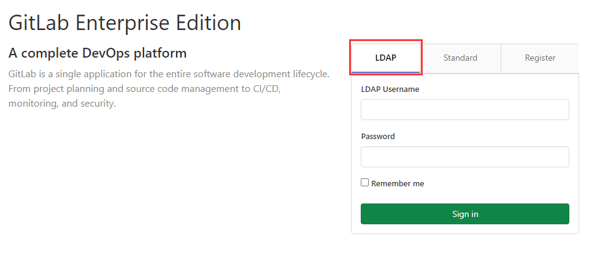

# Gitlab配置LDAP认证


## 修改配置文件

修改配置文件，根据自己LDAP进行配置

```sh
[root@localhost ~]# vim /etc/gitlab/gitlab.rb
gitlab_rails['ldap_enabled'] = true
# gitlab_rails['prevent_ldap_sign_in'] = false

###! **remember to close this block with 'EOS' below**
gitlab_rails['ldap_servers'] = YAML.load <<-'EOS'
  main: # 'main' is the GitLab 'provider ID' of this LDAP server
    label: 'LDAP'
    host: '10.4.7.110'
    port: 389
    uid: 'sAMAccountName'
    uid: 'uid'
    bind_dn: 'cn=admin,dc=loding,dc=com'
    password: '123456'
    encryption: 'plain' # "start_tls" or "simple_tls" or "plain"
    verify_certificates: true
    smartcard_auth: false
    active_directory: true
    allow_username_or_email_login: true
    lowercase_usernames: false
    block_auto_created_users: false
    base: 'ou=People,dc=loding,dc=com'
    user_filter: ''
    attributes:
      username: ['uid', 'userid', 'sAMAccountName']
      email: ['mail', 'email', 'userPrincipalName']
      name: 'cn'
      first_name: 'givenName'
      last_name:  'sn'
    ## EE only
    group_base: ''
    admin_group: ''
    sync_ssh_keys: false
```


## 检查重载配置

> gitlab重新加载配置

```sh
[root@localhost ~]# gitlab-ctl reconfigure
```


> 检查是否能正确获取ldap信息

```sh
[root@localhost gitlab]# gitlab-rake gitlab:ldap:check
Checking LDAP ...

LDAP: ... Server: ldapmain
LDAP authentication... Success
LDAP users with access to your GitLab server (only showing the first 100 results)
	DN: uid=zhushuai,ou=people,dc=loding,dc=com	 uid: zhushuai
	DN: uid=test01,ou=people,dc=loding,dc=com	 uid: test01

Checking LDAP ... Finished
```


## 登录Gitlab

打开gitlab登录页面，可以看到新出现了LDAP认证方式，这时我们使用LDAP用户登录即可。

