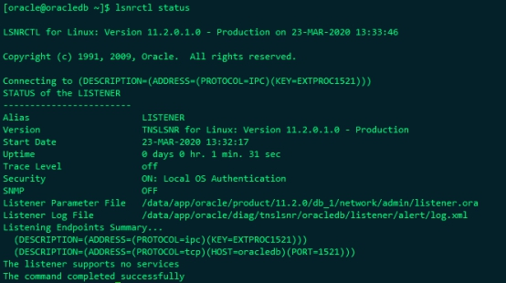
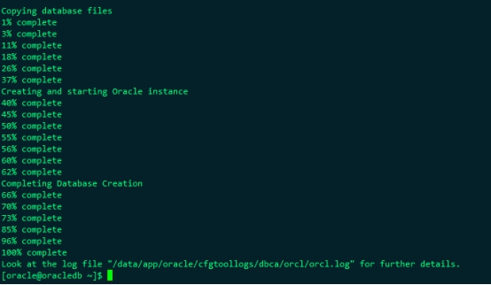
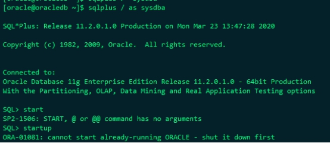

# Centos7下静默安装Oracle

## 环境

cenots7.3最小化安装

Oracle 11g2c Linux


## 准备工作

### 关闭selinux

```shell
sed -i "s/SELINUX=enforcing/SELINUX=disabled/" /etc/selinux/config 
setenforce 0
```


### 开放防火墙端口

```shell
#开放指定端口
firewall-cmd --zone=public --add-port=1521/tcp --permanent
#重新加载配置，使配置生效
firewall-cmd --reload
#查看开放端口是否生效
firewall-cmd --zone=public --list-port
```

 

### 创建用户组及用户

```shell
groupadd oinstall
groupadd dba
groupadd oper
useradd -g oinstall -G dba oracle
#修改oracle用户的登录密码
passwd oracle
```


### 安装rpm依赖包

```shell
yum -y install binutils compat-libcap1 compat-libstdc++-33 gcc gcc-c++ glibc glibc-devel ksh libaio libaio-devel libgcc libstdc++ libstdc++-devel libXi libXtst make sysstat unixODBC unixODBC-devel 
```

验证是否安装成功

```shell
rpm -q binutils compat-libcap1 compat-libstdc++-33 gcc gcc-c++ glibc glibc-devel ksh libaio libaio-devel libgcc libstdc++ libstdc++-devel libXi libXtst make sysstat unixODBC unixODBC-devel | grep "not installed"
```


### 配置内核参数

> vi /etc/sysctk.conf

```shell
# see details in https://help.aliyun.com/knowledge_detail/39428.html
net.ipv4.conf.all.rp_filter=0
net.ipv4.conf.default.rp_filter=0
net.ipv4.conf.default.arp_announce = 2
net.ipv4.conf.lo.arp_announce=2
net.ipv4.conf.all.arp_announce=2

# see details in https://help.aliyun.com/knowledge_detail/41334.html
net.ipv4.tcp_max_tw_buckets = 5000
net.ipv4.tcp_syncookies = 1
net.ipv4.tcp_max_syn_backlog = 1024
net.ipv4.tcp_synack_retries = 2
net.ipv6.conf.all.disable_ipv6 = 1
net.ipv6.conf.default.disable_ipv6 = 1
net.ipv6.conf.lo.disable_ipv6 = 1

 ###以下三个程序一般系统默认就是此配置
net.ipv4.tcp_tw_recycle = 0
net.ipv4.tcp_tw_reuse = 1
net.ipv4.tcp_timestamps = 1

fs.aio-max-nr = 1048576
fs.file-max = 6815744
kernel.shmall = 2097152
kernel.shmmax = 536870912
kernel.shmmni = 4096
kernel.sem = 250 32000 100 128
net.core.rmem_default = 262144
net.core.rmem_max = 4194304
net.core.wmem_default = 262144
net.core.wmem_max = 1048576
```

> 使修改的配置生效

```shell
sysctl -p
```


### 修改文件限制

```
vim /etc/security/limits.conf
*        soft   nproc  2047
*        hard   nproc  16384
*        soft   nofile  1024
*        hard   nofile  65536
oracle   soft   nproc  2047
oracle   hard   nproc  16384
oracle   soft   nofile  1024
oracle   hard   nofile  65536
```


### 修改login

在/etc/pam.d/login 文件中，使用文本编辑器或vi命令增加或修改以下内容

```
session required /lib64/security/pam_limits.so
session required pam_limits.so
```


### 修改环境变量

```shell
vim /etc/profile

if [ $USER = "oracle" ]; then
  if [ $SHELL = "/bin/ksh" ]; then
    ulimit -p 16384
    ulimit -n 65536
  else
    ulimit -u 16384 -n 65536
  fi
fi
```

> 使配置生效

```
source /etc/profile
```


### 创建安装目录

```shell
mkdir /data/app
chown -R oracle:oinstall /data/app
chmod 755 /data/app
```


### 配置oracle环境变量

> 切换到oracle用户

```
su – oracle
```


>  vi .bash_profile
>
> 增加以下内容：

```
umask 022
export ORACLE_HOSTNAME=oracledb
export ORACLE_BASE=/data/app/oracle
export ORACLE_HOME=$ORACLE_BASE/product/11.2.0/
export ORACLE_SID=ORCL
export PATH=.:$ORACLE_HOME/bin:$ORACLE_HOME/OPatch:$ORACLE_HOME/jdk/bin:$PATH
export LC_ALL="en_US"
export LANG="en_US"
export NLS_LANG="AMERICAN_AMERICA.ZHS16GBK"
export NLS_DATE_FORMAT="YYYY-MM-DD HH24:MI:SS"
```

 

## 安装

### 解压安装包

```
cd /data/soft
unzip linuxamd64_12102_database_1of2.zip
unzip linuxamd64_12102_database_2of2.zip
mv /data/soft/database /data/
```

 

### 备份安装文件模板

```
cd /data/database/response
cp db_install.rsp db_install.rsp.bak
```

 

### 配置静默安装参数

> vi /data/database/response/db_install.rsp

```
oracle.install.responseFileVersion=/oracle/install/rspfmt_dbinstall_response_schema_v11_2_0
oracle.install.option=INSTALL_DB_SWONLY
ORACLE_HOSTNAME=oracledb
UNIX_GROUP_NAME=oinstall
INVENTORY_LOCATION=/data/app/oracle/oraInventory
SELECTED_LANGUAGES=en,zh_CN
ORACLE_HOME=/data/app/oracle/product/11.2.0/db_1
ORACLE_BASE=/data/app/oracle
oracle.install.db.InstallEdition=EE
oracle.install.db.isCustomInstall=false
oracle.install.db.customComponents=oracle.server:11.2.0.1.0,oracle.sysman.ccr:10.2.7.0.0,oracle.xdk:11.2.0.1.0,oracle.rdbms.oci:11.2.0.1.0,oracle.network:11.2.0.1.0,oracle.network.listener:11.2.0.1.0,oracle.rdbms:11.2.0.1.0,oracle.options:11.2.0.1.0,oracle.rdbms.partitioning:11.2.0.1.0,oracle.oraolap:11.2.0.1.0,oracle.rdbms.dm:11.2.0.1.0,oracle.rdbms.dv:11.2.0.1.0,orcle.rdbms.lbac:11.2.0.1.0,oracle.rdbms.rat:11.2.0.1.0
oracle.install.db.DBA_GROUP=dba
oracle.install.db.OPER_GROUP=oinstall
oracle.install.db.CLUSTER_NODES=
oracle.install.db.config.starterdb.type=GENERAL_PURPOSE
oracle.install.db.config.starterdb.globalDBName=ora11g
oracle.install.db.config.starterdb.SID=ora11g
oracle.install.db.config.starterdb.characterSet=AL32UTF8
oracle.install.db.config.starterdb.memoryOption=true
oracle.install.db.config.starterdb.memoryLimit=1500
oracle.install.db.config.starterdb.installExampleSchemas=false
oracle.install.db.config.starterdb.enableSecuritySettings=true
oracle.install.db.config.starterdb.password.ALL=oracle
oracle.install.db.config.starterdb.password.SYS=
oracle.install.db.config.starterdb.password.SYSTEM=
oracle.install.db.config.starterdb.password.SYSMAN=
oracle.install.db.config.starterdb.password.DBSNMP=
oracle.install.db.config.starterdb.control=DB_CONTROL
oracle.install.db.config.starterdb.gridcontrol.gridControlServiceURL=
oracle.install.db.config.starterdb.dbcontrol.enableEmailNotification=false
oracle.install.db.config.starterdb.dbcontrol.emailAddress=
oracle.install.db.config.starterdb.dbcontrol.SMTPServer=
oracle.install.db.config.starterdb.automatedBackup.enable=false
oracle.install.db.config.starterdb.automatedBackup.osuid=
oracle.install.db.config.starterdb.automatedBackup.ospwd=
oracle.install.db.config.starterdb.storageType=FILE_SYSTEM_STORAGE
oracle.install.db.config.starterdb.fileSystemStorage.dataLocation=
oracle.install.db.config.starterdb.fileSystemStorage.recoveryLocation=
oracle.install.db.config.asm.diskGroup=
oracle.install.db.config.asm.ASMSNMPPassword=
MYORACLESUPPORT_USERNAME=
MYORACLESUPPORT_PASSWORD=
SECURITY_UPDATES_VIA_MYORACLESUPPORT=
DECLINE_SECURITY_UPDATES=true
PROXY_HOST=
PROXY_PORT=
PROXY_USER=
PROXY_PWD=
```


### 开始静默安装（oracle用户）

```
cd /data/database
./runInstaller -silent -responseFile /data/database/response/db_install.rsp
```

安装日志在/tmp/OraInstall2018-06-28_03-55-51AM/下,出现下图说明安装成功

 


### 使用root用户执行脚本

```
sh /data/app/oracle/oraInventory/orainstRoot.sh
sh /data/app/oracle/product/11.2.0/db_1/root.sh
```


## 配置监听程序

监听命令：

启动监听：lsnrctl start

停止监听：lsnrctl stop

重启监听：lsnrctl reload

查看监听：lsnrctl status


### 配置监听（使用oracle用户）

```
su - oracle
$ORACLE_HOME/bin/netca /silent /responseFile /data/database/response/netca.rsp
```

 


### 查看监听状态

```
lsnrctl status
```

 

同时看到，相应端口已经起来了

 

 

## 静默dbca建库

```
su - root
vim /data/database/response/dbca.rsp

修改如下内容：
GDBNAME = "orcl" # 78 行
SID="orcl" # 149行
CHARACTERSET="AL32UTF8" # 415行
NATIONALCHARACTERSET="UTF8" # 425行
```

 

静默创建dbca库

```
su - oracle
$ORACLE_HOME/bin/dbca -silent -responseFile /data/database/response/dbca.rsp
```

执行完后会先清屏，清屏之后没有提示，直接输入oracle用户的密码，回车，再输入一次，再回车。

稍等一会，会开始自动创建

 


## 启动数据库

 

使用 show parameter；或者 select table_name from dba_tables 看看是否正常


## 配置开机自动启动监听、启动oracle

```
su - root
vim /etc/oratab
*:/data/app/oracle/product/11.2.0/db_1:N

将这一行中的*改为数据库的SID，最后一段的N改为Y
修改后如下：
orcl:/data/app/oracle/product/11.2.0/db_1:Y
保存并退出


vi /etc/rc.local
在文件末尾加入以下内容：
su - oracle -c 'dbstart'
su - oracle -c 'lsnrctl start'
保存并退出

 
增加rc.local文件执行权限
chmod +x /etc/rc.local
```

 