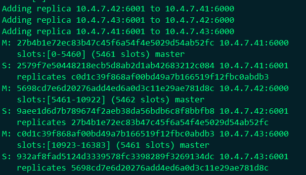

# Redis集群模式

!!! Tip "文档内容参考来源：https://blog.csdn.net/miss1181248983/article/details/90056960，如有侵权请联系删除"

Redis官网：https://redis.io/

Redis全版本下载地址：http://download.redis.io/releases/

Redis集群有三种模式：

- 主从模式
- Sentinel模式
- Cluster模式

## 主从模式

主从模式数据库分两类：主数据和(master)从数据库(slave)

主从模式有一下特点：

-  主数据库可以进行读写操作，当读写操作导致数据变化时会自动将数据同步给从数据库
-  从数据库一般都是只读的，并且接收主数据库同步过来的数据
-  一个master可以拥有多个slave，但是一个slave只能对应一个master
- slave挂了不影响其他slave的读和master的读和写，重新启动后会将数据从master同步过来
-  master挂了以后，不影响slave的读，但redis不再提供写服务，master重启后redis将重新对外提供写服务
- master挂了以后，不会在slave节点中重新选一个master

## Sentinel模式

> Sentine模式特点

- sentinel模式是建立在主从模式的基础上，如果只有一个Redis节点，sentinel就没有任何意义 
- 当master挂了以后，sentinel会在slave中选择一个做为master，并修改它们的配置文件，其他slave的配置文件也会被修改，比如slaveof属性会指向新的master 
-  当master重新启动后，它将不再是master而是做为slave接收新的master的同步数据
- sentinel因为也是一个进程有挂掉的可能，所以sentinel也会启动多个形成一个sentinel集群 
- 多sentinel配置的时候，sentinel之间也会自动监控
- 当主从模式配置密码时，sentinel也会同步将配置信息修改到配置文件中，不需要担心 
- 一个sentinel或sentinel集群可以管理多个主从Redis，多个sentinel也可以监控同一个redis 
- sentinel最好不要和Redis部署在同一台机器，不然Redis的服务器挂了以后，sentinel也挂了


>  Sentinel工作模式机制

- 每个sentinel以每秒钟一次的频率向它所知的master，slave以及其他sentinel实例发送一个 PING 命令  
- 如果一个实例距离最后一次有效回复 PING 命令的时间超过 down-after-milliseconds 选项所指定的值， 则这个实例会被sentinel标记为主观下线。
- 如果一个master被标记为主观下线，则正在监视这个master的所有sentinel要以每秒一次的频率确认master的确进入了主观下线状态 
- 当有足够数量的sentinel（大于等于配置文件指定的值）在指定的时间范围内确认master的确进入了主观下线状态， 则master会被标记为客观下线
- 在一般情况下， 每个sentinel会以每 10 秒一次的频率向它已知的所有master，slave发送 INFO 命令 
-  当master被sentinel标记为客观下线时，sentinel向下线的master的所有slave发送 INFO 命令的频率会从 10 秒一次改为 1 秒一次
-  若没有足够数量的sentinel同意master已经下线，master的客观下线状态就会被移除；  若master重新向sentinel的 PING 命令返回有效回复，master的主观下线状态就会被移除

> Cluster模式

cluster集群特点：

* 多个redis节点网络互联，数据共享

* 所有的节点都是一主一从（也可以是一主多从），其中从不提供服务，仅作为备用

* 不支持同时处理多个key（如MSET/MGET），因为redis需要把key均匀分布在各个节点上，
  并发量很高的情况下同时创建key-value会降低性能并导致不可预测的行为
  
* 支持在线增加、删除节点

* 客户端可以连接任何一个主节点进行读写
## Cluster模式


### Cluster模式搭建

#### 环境准备

操作系统：Centos 7.7

Redis：5.0.9

| IP        | 端口        | 作用                 |
| --------- | ----------- | -------------------- |
| 10.4.7.41 | 6341，16341 | 每台机器启动两个实例 |
| 10.4.7.42 | 6342，16342 | 每台机器启动两个实例 |
| 10.4.7.43 | 6343，16343 | 每台机器启动两个实例 |


#### 安装redis

> 所有redis使用二进制的方式部署，这里仅用一台机器的操作为例，详细步骤不做赘述
>
> 这里我提前将redis的二进制软件包放到了/usr/local/src目录下

```sh
[root@localhost src]# cd /usr/loca/src
[root@localhost src]# tar zxvf redis-5.0.9.tar.gz
[root@localhost src]# mv redis-5.0.9 /usr/local/redis
[root@localhost src]# yum install -y gcc tcl
[root@localhost src]# cd /usr/local/redis/deps
[root@localhost deps]# make hiredis jemalloc linenoise lua
[root@localhost deps]# cd ..
[root@localhost redis]# make install PREFIX=/usr/local/redis 
```


#### 修改配置文件

> 10.4.7.41

```sh
[root@localhost src]# cd /usr/local/redis
[root@localhost redis]# mkdir cluster
[root@localhost redis]# cp redis.conf cluster/redis_6000.conf
[root@localhost redis]# cp redis.conf cluster/redis_6001.conf
[root@localhost redis]# mkdir -p /data/redis/data/{redis_6000,redis_6001}
[root@localhost redis]# mkdir -p /data/redis/logs
[root@localhost redis]# vi cluster/redis_6000.conf
bind 10.4.7.41
port 6000
daemonize yes
pidfile "/var/run/redis_6000.pid"
logfile "/data/redis/logs/redis_6000.log"
dir "/data/redis/data/redis_6000"
masterauth 123456
requirepass 123456
appendonly yes
cluster-enabled yes
cluster-config-file nodes_6000.conf

[root@localhost redis]# vi cluster/redis_6001.conf
bind 10.4.7.41
port 6001
daemonize yes
pidfile "/var/run/redis_6001.pid"
logfile "/usr/local/redis/cluster/redis_6001.log"
dir "/data/redis/cluster/redis_6001"
masterauth 123456
requirepass 123456
appendonly yes
cluster-enabled yes
cluster-config-file nodes_6001.conf
```


> 10.4.7.42

```sh
[root@localhost src]# cd /usr/local/redis
[root@localhost redis]# mkdir cluster
[root@localhost redis]# cp redis.conf cluster/redis_6000.conf
[root@localhost redis]# cp redis.conf cluster/redis_6001.conf
[root@localhost redis]# mkdir -p /data/redis/data/{redis_6000,redis_6001}
[root@localhost redis]# mkdir -p /data/redis/logs
[root@localhost redis]# vi cluster/redis_6000.conf
bind 10.4.7.42
port 6000
daemonize yes
pidfile "/var/run/redis_6000.pid"
logfile "/data/redis/logs/redis_6000.log"
dir "/data/redis/data/redis_6000"
masterauth 123456
requirepass 123456
appendonly yes
cluster-enabled yes
cluster-config-file nodes_6000.conf

[root@localhost redis]# vi cluster/redis_6001.conf
bind 10.4.7.42
port 6001
daemonize yes
pidfile "/var/run/redis_6001.pid"
logfile "/usr/local/redis/cluster/redis_6001.log"
dir "/data/redis/cluster/redis_6001"
masterauth 123456
requirepass 123456
appendonly yes
cluster-enabled yes
cluster-config-file nodes_6001.conf
```

> 10.4.7.43

```sh
[root@localhost src]# cd /usr/local/redis
[root@localhost redis]# mkdir cluster
[root@localhost redis]# cp redis.conf cluster/redis_6000.conf
[root@localhost redis]# cp redis.conf cluster/redis_6001.conf
[root@localhost redis]# mkdir -p /data/redis/data/{redis_6000,redis_6001}
[root@localhost redis]# mkdir -p /data/redis/logs
[root@localhost redis]# vi cluster/redis_6000.conf
bind 10.4.7.43
port 6000
daemonize yes
pidfile "/var/run/redis_6000.pid"
logfile "/data/redis/logs/redis_6000.log"
dir "/data/redis/data/redis_6000"
masterauth 123456
requirepass 123456
appendonly yes
cluster-enabled yes
cluster-config-file nodes_6000.conf

[root@localhost redis]# vi cluster/redis_6001.conf
bind 10.4.7.43
port 6001
daemonize yes
pidfile "/var/run/redis_6001.pid"
logfile "/usr/local/redis/cluster/redis_6001.log"
dir "/data/redis/cluster/redis_6001"
masterauth 123456
requirepass 123456
appendonly yes
cluster-enabled yes
cluster-config-file nodes_6001.conf
```

#### 启动redis

> 10.4.7.41

```sh
[root@localhost redis]# ./bin/redis-server ./cluster/redis_6000.conf
[root@localhost redis]# ./bin/redis-server ./cluster/redis_6001.conf
```

> 10.4.7.42

```sh
[root@localhost redis]# ./bin/redis-server ./cluster/redis_6000.conf
[root@localhost redis]# ./bin/redis-server ./cluster/redis_6001.conf
```

> 10.4.7.43

```sh
[root@localhost redis]# ./bin/redis-server ./cluster/redis_6000.conf
[root@localhost redis]# ./bin/redis-server ./cluster/redis_6001.conf
```


#### 集群创建

```sh
[root@localhost redis]# ./bin/redis-cli -a 123456 --cluster create 10.4.7.41:6000 10.4.7.41:6001 10.4.7.42:6000 10.4.7.42:6001 10.4.7.43:6000 10.4.7.43:6001 --cluster-replicas 1
Warning: Using a password with '-a' or '-u' option on the command line interface may not be safe.
>>> Performing hash slots allocation on 6 nodes...
Master[0] -> Slots 0 - 5460
Master[1] -> Slots 5461 - 10922
Master[2] -> Slots 10923 - 16383
Adding replica 10.4.7.42:6001 to 10.4.7.41:6000
Adding replica 10.4.7.43:6001 to 10.4.7.42:6000
Adding replica 10.4.7.41:6001 to 10.4.7.43:6000
M: 27b4b1e72ec83b47c45f6a54f4e5029d54ab52fc 10.4.7.41:6000
   slots:[0-5460] (5461 slots) master
S: 2579f7e50448218ecb5d8ab2d1ab42683212c084 10.4.7.41:6001
   replicates c0d1c39f868af00bd49a7b166519f12fbc0abdb3
M: 5698cd7e6d20276add4ed6a0d3c11e29ae781d8c 10.4.7.42:6000
   slots:[5461-10922] (5462 slots) master
S: 9aee1d6d7b789674f2aeb38da56bdb6c8f8bbfb8 10.4.7.42:6001
   replicates 27b4b1e72ec83b47c45f6a54f4e5029d54ab52fc
M: c0d1c39f868af00bd49a7b166519f12fbc0abdb3 10.4.7.43:6000
   slots:[10923-16383] (5461 slots) master
S: 932af8fad5124d3339578fc3398289f3269134dc 10.4.7.43:6001
   replicates 5698cd7e6d20276add4ed6a0d3c11e29ae781d8c
Can I set the above configuration? (type 'yes' to accept): yes  #输入yes接受配置
>>> Nodes configuration updated
>>> Assign a different config epoch to each node
>>> Sending CLUSTER MEET messages to join the cluster
Waiting for the cluster to join
.....
>>> Performing Cluster Check (using node 10.4.7.41:6000)
M: 27b4b1e72ec83b47c45f6a54f4e5029d54ab52fc 10.4.7.41:6000
   slots:[0-5460] (5461 slots) master
   1 additional replica(s)
S: 932af8fad5124d3339578fc3398289f3269134dc 10.4.7.43:6001
   slots: (0 slots) slave
   replicates 5698cd7e6d20276add4ed6a0d3c11e29ae781d8c
M: 5698cd7e6d20276add4ed6a0d3c11e29ae781d8c 10.4.7.42:6000
   slots:[5461-10922] (5462 slots) master
   1 additional replica(s)
S: 2579f7e50448218ecb5d8ab2d1ab42683212c084 10.4.7.41:6001
   slots: (0 slots) slave
   replicates c0d1c39f868af00bd49a7b166519f12fbc0abdb3
S: 9aee1d6d7b789674f2aeb38da56bdb6c8f8bbfb8 10.4.7.42:6001
   slots: (0 slots) slave
   replicates 27b4b1e72ec83b47c45f6a54f4e5029d54ab52fc
M: c0d1c39f868af00bd49a7b166519f12fbc0abdb3 10.4.7.43:6000
   slots:[10923-16383] (5461 slots) master
   1 additional replica(s)
[OK] All nodes agree about slots configuration.
>>> Check for open slots...
>>> Check slots coverage...
[OK] All 16384 slots covered.
```


这里我们可以看到集群中各节点的主从关系

 


> 相关目录下也生成了我们的集群配置文件

```
[root@localhost redis]# ls -al /data/redis/data/redis_6000/
total 4
drwxr-xr-x 2 root root  50 Aug 15 10:46 .
drwxr-xr-x 6 root root  79 Aug 15 10:47 ..
-rw-r--r-- 1 root root   0 Aug 15 10:46 appendonly.aof
-rw-r--r-- 1 root root 781 Aug 15 10:55 node_6000.conf
```


#### 集群检查

登录集群查看相关信息

```sh
[root@localhost redis]# ./bin/redis-cli -c -h 10.4.7.41 -p 6000 -a 123456
Warning: Using a password with '-a' or '-u' option on the command line interface may not be safe.
10.4.7.41:6000> CLUSTER INFO
cluster_state:ok
cluster_slots_assigned:16384
cluster_slots_ok:16384
cluster_slots_pfail:0
cluster_slots_fail:0
cluster_known_nodes:6
cluster_size:3
cluster_current_epoch:6
cluster_my_epoch:1
cluster_stats_messages_ping_sent:277
cluster_stats_messages_pong_sent:283
cluster_stats_messages_sent:560
cluster_stats_messages_ping_received:278
cluster_stats_messages_pong_received:277
cluster_stats_messages_meet_received:5
cluster_stats_messages_received:560
10.4.7.41:6000> CLUSTER NODES
27b4b1e72ec83b47c45f6a54f4e5029d54ab52fc 10.4.7.41:6000@16000 myself,master - 0 1597460440000 1 connected 0-5460
932af8fad5124d3339578fc3398289f3269134dc 10.4.7.43:6001@16001 slave 5698cd7e6d20276add4ed6a0d3c11e29ae781d8c 0 1597460441296 6 connected
5698cd7e6d20276add4ed6a0d3c11e29ae781d8c 10.4.7.42:6000@16000 master - 0 1597460440289 3 connected 5461-10922
2579f7e50448218ecb5d8ab2d1ab42683212c084 10.4.7.41:6001@16001 slave c0d1c39f868af00bd49a7b166519f12fbc0abdb3 0 1597460439280 5 connected
9aee1d6d7b789674f2aeb38da56bdb6c8f8bbfb8 10.4.7.42:6001@16001 slave 27b4b1e72ec83b47c45f6a54f4e5029d54ab52fc 0 1597460438276 4 connected
c0d1c39f868af00bd49a7b166519f12fbc0abdb3 10.4.7.43:6000@16000 master - 0 1597460441000 5 connected 10923-16383
```

