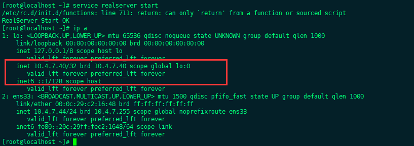
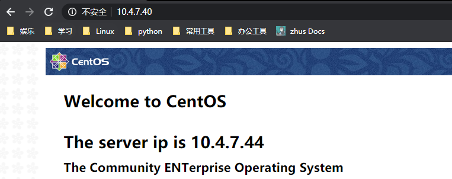

# LVS

LVS是Linux Virtual Server的简写，意即Linux虚拟服务器，是一个虚拟的服务器集群系统。本项目在1998年5月由[章文嵩](https://baike.baidu.com/item/章文嵩/6689425)博士成立，是中国国内最早出现的自由软件项目之一。

其可用性=可用时间/（可用时间+故障恢复时间），通常用百分比来表示；99.9%表示一年的故障时间少于8小时；99.99%表示一年的故障时间少于53分钟；99.999%表示一年的故障时间小于5分钟。

## 名词定义

- DS(Director Server)：负责调度集群的主机；也简称调度器、分发器

- VIP(Director Virtual IP)： 向外提供服务的IP；通常此IP绑定域名

- DIP(Director IP)：与内部主机RIP通信的IP，在Director主机上

- RIP(Real Server IP)：内部真正提供服务的主机

- CIP(Client IP)：客户端IP


## 核心组件：

lp_vs：linux内核功能模块，工作在内核，依赖该内核模块实现负载均衡功能。

ipvsadm：应用层程序，可与lp_vs通信实现对负载均衡的管理和控制。


## LVS的工作模式

lvs有四种工作模式分别为DR模式、NAT模式、TUNNEL模式、FULLNET模式。

### DR模式直接路由

原理：用户先向DNS服务器发送域名解析，DNS向用户返回解析结果此结果为代理服务器的ip地址和mac地址，用户正式向代理服务器发送请求，代理服务器接受请求后会重新分装该请求，通过预先设定的算法找出一个后端的web服务器的mac地址将数据包的目标mac地址改为此mac地址；然后在内网中广播，后端的web服务器接收数据包后会判断其目标mac地址与自己的mac地址是否相同，如果相同就会处理该数据包，处理完成后直接发送给用户；如果不相同则丢弃该数据报。

### NAT模式

原理：用户先向DNS发送域名解析，DNS将解析结构返回给用户，这里的返回结果是代理服务器上的一个虚拟ip，我们称之为vip；用户向vip发送数据报这时代理服务器会接收此数据报；然后通过预先设定的算法找出一个后端节点的真实ip我们称之为RIP，代理服务器重新封装数据包将目标ip改为RIP；web服务器收到代理服务器的转发数据包后，处理数据包，处理完成后将处理结果返回给代理服务器，再由代理服务器转发给用户。

### TUNNEL模式

这里我们不做详细介绍，TUNNEL会在原有的报文基础上添加一个新的ip报头。

### FULLNAT模式

是NAT模型的扩展代理服务器和web服务器可以不在同一网段。


## LVS的调度算法

### 轮询调度(RR)

轮询调度（Round Robin 简称'RR'）算法就是按依次循环的方式将请求调度到不同的服务器上，该算法最大的特点就是实现简单。轮询算法假设所有的服务器处理请求的能力都一样的，调度器会将所有的请求平均分配给每个真实服务器。

### 加权轮询调度(WRR)

加权轮询（Weight Round Robin 简称'WRR'）算法主要是对轮询算法的一种优化与补充，LVS会考虑每台服务器的性能，并给每台服务器添加一个权值，如果服务器A的权值为1，服务器B的权值为2，则调度器调度到服务器B的请求会是服务器A的两倍。权值越高的服务器，处理的请求越多。

### 最小连接调度(LC)

最小连接调度（Least Connections 简称'LC'）算法是把新的连接请求分配到当前连接数最小的服务器。最小连接调度是一种动态的调度算法，它通过服务器当前活跃的连接数来估计服务器的情况。调度器需要记录各个服务器已建立连接的数目，当一个请求被调度到某台服务器，其连接数加1；当连接中断或者超时，其连接数减1。

（集群系统的真实服务器具有相近的系统性能，采用最小连接调度算法可以比较好地均衡负载。)

### 加权最小连接调度(WLC)

加权最少连接（Weight Least Connections 简称'WLC'）算法是最小连接调度的超集，各个服务器相应的权值表示其处理性能。服务器的缺省权值为1，系统管理员可以动态地设置服务器的权值。加权最小连接调度在调度新连接时尽可能使服务器的已建立连接数和其权值成比例。调度器可以自动问询真实服务器的负载情况，并动态地调整其权值。

### 基于局部的最少连接(LBLC)

基于局部的最少连接调度（Locality-Based Least Connections 简称'LBLC'）算法是针对请求报文的目标IP地址的 负载均衡调度，目前主要用于Cache集群系统，因为在Cache集群客户请求报文的目标IP地址是变化的。这里假设任何后端服务器都可以处理任一请求，算法的设计目标是在服务器的负载基本平衡情况下，将相同目标IP地址的请求调度到同一台服务器，来提高各台服务器的访问局部性和Cache命中率，从而提升整个集群系统的处理能力。LBLC调度算法先根据请求的目标IP地址找出该目标IP地址最近使用的服务器，若该服务器是可用的且没有超载，将请求发送到该服务器；若服务器不存在，或者该服务器超载且有服务器处于一半的工作负载，则使用'最少连接'的原则选出一个可用的服务器，将请求发送到服务器。

### 带复制的基于局部性的最少连接(LBLCR)

带复制的基于局部性的最少连接（Locality-Based Least Connections with Replication  简称'LBLCR'）算法也是针对目标IP地址的负载均衡，目前主要用于Cache集群系统，它与LBLC算法不同之处是它要维护从一个目标IP地址到一组服务器的映射，而LBLC算法维护从一个目标IP地址到一台服务器的映射。按'最小连接'原则从该服务器组中选出一一台服务器，若服务器没有超载，将请求发送到该服务器；若服务器超载，则按'最小连接'原则从整个集群中选出一台服务器，将该服务器加入到这个服务器组中，将请求发送到该服务器。同时，当该服务器组有一段时间没有被修改，将最忙的服务器从服务器组中删除，以降低复制的程度。

### 目标地址哈希调度(DH)

目标地址哈希调度（Destination Hashing 简称'DH'）算法先根据请求的目标IP地址，作为散列键（Hash Key）从静态分配的散列表找出对应的服务器，若该服务器是可用的且并未超载，将请求发送到该服务器，否则返回空。

### 源地址哈希调度(SH)

源地址哈希调度（Source Hashing  简称'SH'）算法先根据请求的源IP地址，作为散列键（Hash Key）从静态分配的散列表找出对应的服务器，若该服务器是可用的且并未超载，将请求发送到该服务器，否则返回空。它采用的散列函数与目标地址散列调度算法的相同，它的算法流程与目标地址散列调度算法的基本相似。

### 最短的期望的延迟(SED)

最短的期望的延迟调度（Shortest Expected Delay 简称'SED'）算法基于WLC算法。举个例子吧，ABC三台服务器的权重分别为1、2、3 。那么如果使用WLC算法的话一个新请求进入时它可能会分给ABC中的任意一个。使用SED算法后会进行一个运算

A：（1+1）/1=2   B：（1+2）/2=3/2   C：（1+3）/3=4/3   就把请求交给得出运算结果最小的服务器。

### 最少队列调度(NQ)

最少队列调度（Never Queue 简称'NQ'）算法，无需队列。如果有realserver的连接数等于0就直接分配过去，不需要在进行SED运算


## LVS+Keepalived实现DR模式

本文参考来源：https://blog.csdn.net/lupengfei1009/article/details/86514445

### 实验环境

|    IP     |  操作系统  | 配置 |        用途        |
| :-------: | :--------: | :--: | :----------------: |
| 10.4.7.40 | Centos 7.7 | VIP  |   虚拟IP（VIP）    |
| 10.4.7.41 | Centos 7.7 | 2C2G | Keepavlied  Master |
| 10.4.7.42 | Centos 7.7 | 2C2G | Keepavlied  Slave  |
| 10.4.7.43 | Centos 7.7 | 2C2G |      nginx-1       |
| 10.4.7.44 | Centos 7.7 | 2C2G |      nginx-2       |

可以根据自己的电脑配置进行配置的缩减，也可以将keepalive和nginx安装在一台机器上，这样使用两台机器就可以完成实验

### 实验准备

关闭所有机器的防火墙和Selinux(生产环境不建议这样操作)

```sh
systemctl stop firewalld
systemctl disable firewalld
setenforce 0
sed -i "s/SELINUX=enforcing/SELINUX=disabled/g" /etc/selinux/config
```


### 安装ipvsadm

在10.4.7.41和10.4.7.42服务器上安装

```
yum install ipvsadm -y
```


### 安装nginx服务

在10.4.7.43和10.4.7.44服务器上安装nginx服务

```sh
yum install epel-release -y
yum install nginx -y
systemctl start nginx
systecmtl enable nginx
```

我们为了区分两台服务器分别在每台默认服务器的默认页面增加一个区分的标记

nginx默认页面文件路径：/usr/share/nginx/html/index.html

- 10.4.7.43

 

- 10.4.7.44

 


### 配置realserver脚本文件

在10.4.7.43和10.4.7.44服务器上进行操作配置

> vi /etc/init.d/realserver

```sh
#虚拟的vip 根据自己的实际情况定义
SNS_VIP=10.4.7.40
/etc/rc.d/init.d/functions
case "$1" in
start)
       ifconfig lo:0 $SNS_VIP netmask 255.255.255.255 broadcast $SNS_VIP
       /sbin/route add -host $SNS_VIP dev lo:0
       echo "1" >/proc/sys/net/ipv4/conf/lo/arp_ignore
       echo "2" >/proc/sys/net/ipv4/conf/lo/arp_announce
       echo "1" >/proc/sys/net/ipv4/conf/all/arp_ignore
       echo "2" >/proc/sys/net/ipv4/conf/all/arp_announce
       sysctl -p >/dev/null 2>&1
       echo "RealServer Start OK"
       ;;
stop)
       ifconfig lo:0 down
       route del $SNS_VIP >/dev/null 2>&1
       echo "0" >/proc/sys/net/ipv4/conf/lo/arp_ignore
       echo "0" >/proc/sys/net/ipv4/conf/lo/arp_announce
       echo "0" >/proc/sys/net/ipv4/conf/all/arp_ignore
       echo "0" >/proc/sys/net/ipv4/conf/all/arp_announce
       sysctl -p >/dev/null 2>&1
       echo "RealServer Stoped"
       ;;
*)
       echo "Usage: $0 {start|stop}"
       exit 1
esac
exit 0
```

> 对脚本增加执行权限

```sh
chmod +x /etc/init.d/realserver
chmod +x /etc/rc.d/init.d/functions
```

> 执行脚本

```sh
service realserver start 
```

!!! waring "脚本执行提示没有ifconifg和/sbin/route命令的需要安装net-tools工具包"

执行后看到下图界面说明操作成功了



### 安装配置Keepalived

在10.4.7.41和10.4.7.42服务器上安装并配置keepalived服务

#### 安装

```sh
yum install keepalived -y
```

#### 配置

正常情况下生产环境会配置为非抢占模式，因为VIP漂移属于生产事故，是不允许VIP随意进行漂移的

> 10.4.7.41

```sh
vi /etc/keepalived/keepalived.conf
vrrp_instance VI_1 {
    state MASTER            #指定Keepalived的角色，MASTER为主，BACKUP为备 记得大写
    interface ens33         #网卡id 不同的电脑网卡id会有区别 可以使用:ip a查看
    virtual_router_id 51    #虚拟路由编号，主备要一致
    priority 100            #定义优先级，数字越大，优先级越高，主DR必须大于备用DR
    advert_int 1            #检查间隔，默认为1s
    authentication {        #这里配置的密码最多为8位，主备要一致，否则无法正常通讯
        auth_type PASS
        auth_pass 1111
    }
    virtual_ipaddress {
        10.4.7.40          #定义虚拟IP(VIP)为10.4.7.40，可多设，每行一个   
    }
}
# 定义对外提供服务的LVS的VIP以及port
virtual_server 10.4.7.40 80 {
    delay_loop 5          # 设置健康检查时间，单位是秒
    lb_algo rr            # 设置负载调度的算法为wlc
    lb_kind DR            # 设置LVS实现负载的机制，有NAT、TUN、DR三个模式
    nat_mask 255.255.255.0
    persistence_timeout 0
    protocol TCP
    real_server 10.4.7.43 80 {  # 指定real server1的IP地址    
        weight 10              # 配置节点权值，数字越大权重越高  
        TCP_CHECK {
        connect_timeout 10
        nb_get_retry 3
        delay_before_retry 3
        connect_port 80
        }
    }
    real_server 10.4.7.44 80 {  # 指定real server2的IP地址    
        weight 10              # 配置节点权值，数字越大权重越高    
        TCP_CHECK {
        connect_timeout 10
        nb_get_retry 3
        delay_before_retry 3
        connect_port 80
        }
     }
}
```

> 10.4.7.42

```sh
vi /etc/keepalived/keepalived.conf
vrrp_instance VI_1 {
    state BACKUP            #指定Keepalived的角色，MASTER为主，BACKUP为备 记得大写
    interface ens33         #网卡id 不同的电脑网卡id会有区别 可以使用:ip a查看
    virtual_router_id 51    #虚拟路由编号，主备要一致
    priority 50            #定义优先级，数字越大，优先级越高，主DR必须大于备用DR
    advert_int 1            #检查间隔，默认为1s
    authentication {        #这里配置的密码最多为8位，主备要一致，否则无法正常通讯
        auth_type PASS
        auth_pass 1111
    }
    virtual_ipaddress {
        10.4.7.40          #定义虚拟IP(VIP)为10.4.7.40，可多设，每行一个   
    }
}
# 定义对外提供服务的LVS的VIP以及port
virtual_server 10.4.7.40 80 {
    delay_loop 5          # 设置健康检查时间，单位是秒
    lb_algo rr            # 设置负载调度的算法为wlc
    lb_kind DR            # 设置LVS实现负载的机制，有NAT、TUN、DR三个模式
    nat_mask 255.255.255.0
    persistence_timeout 0
    protocol TCP
    real_server 10.4.7.43 80 {  # 指定real server1的IP地址    
        weight 10              # 配置节点权值，数字越大权重越高  
        TCP_CHECK {
        connect_timeout 10
        nb_get_retry 3
        delay_before_retry 3
        connect_port 80
        }
    }
    real_server 10.4.7.44 80 {  # 指定real server2的IP地址    
        weight 10              # 配置节点权值，数字越大权重越高    
        TCP_CHECK {
        connect_timeout 10
        nb_get_retry 3
        delay_before_retry 3
        connect_port 80
        }
     }
}
```


#### 启动

```sh
systemctl start keepalived
```


启动后可以在Keepalived的Master服务器上看到VIP，Backup服务器上没有VIP，说明服务正常


### 测试

#### 访问测试

通过浏览器访问VIP，可以看到页面，通过不停的强制刷新页面可以看到访问地址在不停变化，如果使用Chrom浏览器无法看到此变化的，可以更换火狐浏览器或者使用Chrome的无痕浏览模式，使用Ctrl+F5不停的刷新页面




同时我们在10.4.7.41服务器上也可以通过ipvsadm相关命令看到分发的信息

 

#### 脑裂测试

注意yum安装的keepalived使用systemctl restart keepalived的时候会出现进程无法杀死的情况，可以注释启动脚本/usr/lib/systemd/system/keepalived.service中的KillMode=process配置项，然后使用systemctl daemon-reload重载服务即可

脑裂测试这里不做详细的描述


### LVS FTP负载均衡

使用lvs做FTP负载均衡的时候，上传会占用LVS大量的流量，可以考虑使用下面的操作进行处理

iptables -t nat -A PREROUTING -p tcp --dport $pasv_min_port:$pasv_max_port -j DNAT --to-destination $vip

注意设置FTP的pasv_address为RS地址

方法来源： https://blog.csdn.net/weixin_34318272/article/details/91660644 