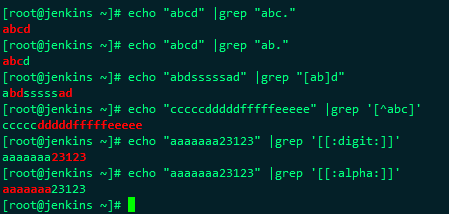

# 正则表达式

## 字符类

|   字符    | 含义                                                   | 例子                                             |
| :-------: | ------------------------------------------------------ | ------------------------------------------------ |
|     .     | 匹配任意一个字符                                       | a.可以匹配ab、ac、ad等等                         |
|    []     | 匹配括号中的任意一个字符                               | [abc]d可以匹配ad、bd或cd                         |
|     -     | 在[]括号中使用，表示字符范围                           | [0-9a-fA-F]可以匹配一位十六进制数字              |
|     ^     | 位于[]括号中的字符，匹配除括号中的字符外的任意一个字符 | [^ab]匹配除了a、b之外的任一字符                  |
| [[:xxx:]] | grep工具预定义的一些命名字符                           | [[:digit:]] 匹配一个数字   [[:alpha:]]匹配一个字 |

 

## 数量限定符

| 字符  | 含义                                     | 例子 |
| :---: | ---------------------------------------- | ---- |
|  ？   | 紧跟在他前面的单元应匹配零次或一次       |      |
|   +   | 紧跟在他前面的单元应匹配一次或多次       |      |
|   *   | 紧跟在他前面的单元应匹配零次或多次       |      |
|  {N}  | 紧跟在他前面的单元应精确匹配N次          |      |
| {N,}  | 紧跟在他前面的单元应匹配至少N次          |      |
| {,M}  | 紧跟在他前面的单元应匹配最多M次          |      |
| {N,M} | 紧跟在他前面的单元应匹配最少N此，最多M次 |      |

## 位置限定符

| 字符 | 含义                       |      |
| ---- | -------------------------- | ---- |
| ^    | 匹配行首的位置             |      |
| $    | 匹配行末的位置             |      |
| \\>  | 匹配单词开头的位置         |      |
| \\<  | 匹配单词词尾的位置         |      |
| \\b  | 匹配单词的开头或结尾的位置 |      |
| \\B  | 匹配非单词开头或结尾的位置 |      |

